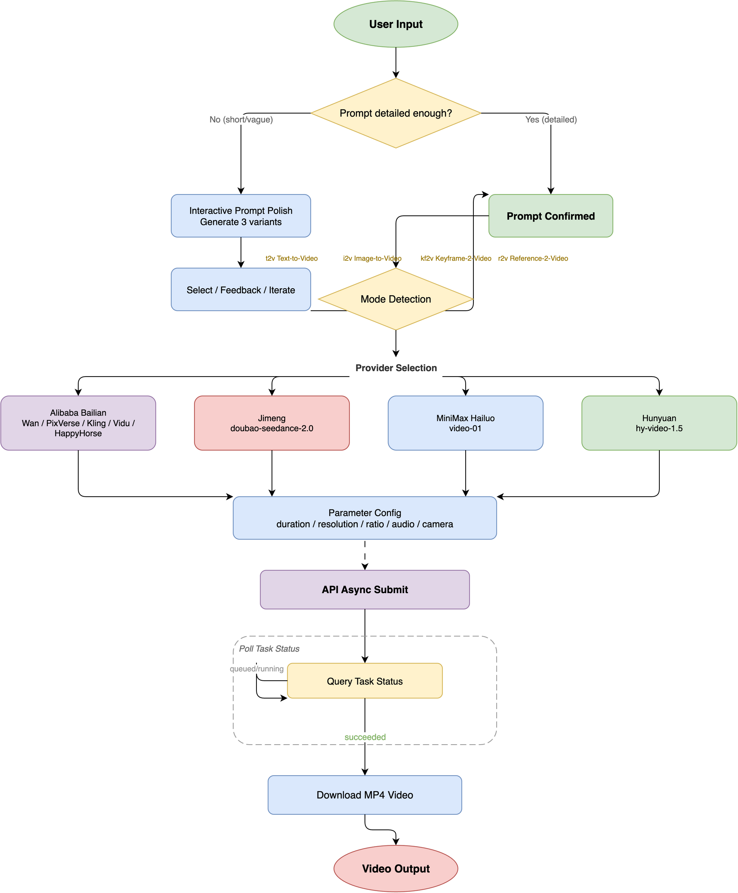

# videogenCN 🎬

[中文文档](README_CN.md)

A Claude Code / OpenClaw skill for generating video clips with Chinese video models across four providers — Alibaba Bailian (Wan/PixVerse/Kling/Vidu/HappyHorse), Volcengine Ark (Jimeng/即梦), MiniMax (海螺 AI), and Tencent Hunyuan (混元).

## Features

- **Four modes, one script**: prompt → t2v; `--image` → i2v; `+ --last-frame` → kf2v; `--ref name=img` → r2v
- **Seven model families across four providers**: Bailian (Wan, PixVerse, Kling, Vidu, HappyHorse), Jimeng (Volcengine), MiniMax (Hailuo), Hunyuan (Tencent)
- **Provider auto-detection**: `--provider` flag or auto-detect from model name; backward compatible
- **Local images just work**: base64 for Wan/HappyHorse/Jimeng; auto-upload for PixVerse/Kling/Vidu/MiniMax
- **Multi-shot narratives**: `wan2.7-t2v` renders up to 15s with per-shot descriptions
- **Audio control**: `--audio` (third-party) / `--no-audio` (Wan)
- **Resumable**: long tasks print a task id; `--task-id` resumes polling

## Pipeline



## Install

**In a coding agent** — tell it:

> help me to install https://github.com/Agents365-ai/videogenCN.git

**365-Skills Marketplace** (in Claude Code):

```bash
/plugin install videogenCN@365-skills
```

**Manual:**

```bash
git clone https://github.com/Agents365-ai/videogenCN.git /tmp/videogenCN
ln -s /tmp/videogenCN/skills/videogenCN ~/.claude/skills/videogenCN  # global
# or: ln -s /tmp/videogenCN/skills/videogenCN .claude/skills         # project
# or: ln -s /tmp/videogenCN/skills/videogenCN ~/.openclaw/skills     # OpenClaw
```

## Requirements

- Python 3.8+
- `pip install requests`
- At least one provider API key (see below)

### Provider API Keys

| Provider | Env Vars | Get Key At |
|----------|----------|------------|
| **Bailian** (Wan/PixVerse/Kling/Vidu/HappyHorse) | `DASHSCOPE_API_KEY` | https://bailian.console.aliyun.com/ |
| **Jimeng** (即梦) | `ARK_API_KEY` | https://console.volcengine.com/ark/ |
| **MiniMax** (海螺 AI) | `MINIMAX_API_KEY` | https://platform.minimax.io |
| **Hunyuan** (混元) | `HUNYUAN_API_KEY` | https://console.cloud.tencent.com/hunyuan |

```bash
# Bailian (required for default provider)
export DASHSCOPE_API_KEY='your-api-key'

# Jimeng (optional)
export ARK_API_KEY='your-api-key'

# MiniMax (optional)
export MINIMAX_API_KEY='your-api-key'

# Hunyuan (optional)
export HUNYUAN_API_KEY='your-api-key'
```

Optional environment variables:

| Variable | Purpose |
|----------|---------|
| `DASHSCOPE_API_BASE` | Bailian region: `cn` (default) / `sg` / `us` or a full URL |
| `DASHSCOPE_VIDEO_MODEL` | Bailian default model override |

## Quick Start

**Natural language** (in Claude Code):

> 用万相生成一段 5 秒的视频:一只柴犬在樱花树下奔跑
> 用即梦生成一段 10 秒的竖屏视频:赛博朋克雨夜街头

**Command line:**

```bash
# Text-to-video (Bailian default)
python scripts/generate_video.py "A shiba inu running under cherry blossoms" out.mp4

# Image-to-video (animate a still)
python scripts/generate_video.py "Camera slowly zooms in" out.mp4 --image photo.png

# Vertical short-video clip
python scripts/generate_video.py "Cyberpunk rainy street" city.mp4 --ratio 9:16

# Jimeng (即梦)
python scripts/generate_video.py "城市日落延时摄影" sunset.mp4 --provider jimeng --duration 10

# MiniMax (海螺)
python scripts/generate_video.py "海浪拍打礁石" ocean.mp4 --provider minimax --duration 6

# Hunyuan (混元)
python scripts/generate_video.py "金黄色的麦田在秋风中起伏" field.mp4 --provider hunyuan --duration 5
```

## Models

### Bailian (百炼) — 5 families

| Family | Models | Modes | Duration |
|--------|--------|-------|----------|
| Wan 通义万相 | `wan2.7-t2v-*` (t2v default), `wan2.6-i2v-flash` (i2v default), `wan2.5/2.2/wanx2.1` series | t2v, i2v | up to 15s |
| PixVerse 爱诗 | `pixverse/pixverse-{c1,v6,v5.6}-{t2v,it2v,kf2v,r2v}` | all four | 1–15s |
| Kling 可灵 | `kling/kling-v3-video-generation`, `kling/kling-v3-omni-video-generation` | t2v, i2v, kf2v (+r2v on omni) | 3–15s |
| Vidu | `vidu/viduq3-{pro,turbo}_{text2video,img2video,start-end2video}`, `viduq2*` | t2v, i2v, kf2v | q3: 1–16s |
| HappyHorse | `happyhorse-{1.1,1.0}-{t2v,i2v}` | t2v, i2v | 3–15s |

### Jimeng (即梦 / Volcengine Ark)

| Family | Models | Modes | Duration |
|--------|--------|-------|----------|
| Jimeng Seedance | `doubao-seedance-2-0-260128` (default), `doubao-seedance-2-0-fast-260128`, `doubao-seedance-1-5-pro-251215`, `doubao-seedance-1-0-pro` | t2v, i2v | up to 15s |

> ✅ Tested: t2v 5s, ~4 min, 5.6 MB MP4

### MiniMax (海螺 AI)

| Family | Models | Modes | Duration |
|--------|--------|-------|----------|
| MiniMax | `video-01` (t2v/i2v default) | t2v, i2v | 6s |

> ✅ Tested: t2v 6s, ~3 min, 2.9 MB MP4

### Hunyuan (混元 / Tencent)

| Family | Models | Modes | Duration |
|--------|--------|-------|----------|
| Hunyuan | `hy-video-1.5` (t2v/i2v default), `yt-video-2.0` (i2v, experimental), `yt-video-fx` (i2v, experimental), `yt-video-humanactor` (i2v, experimental) | t2v, i2v | 5–10s |

> ⚠️ **Note**: `--duration` and `--seed` supported on `hy-video-1.5` only. `--resolution`, `--ratio`, `--audio`, and `--camera-motion` are not yet available for Hunyuan. Experimental models (yt-video-*) are i2v-only with basic prompt+image support.

Run `python scripts/generate_video.py --list-models` for the current list. Third-party Bailian families are Beijing region (`cn`) only.

> **Cost**: video generation bills per second of output (roughly $0.04–0.14/s depending on model and resolution). Result URLs expire after 24h — the script downloads immediately.

## Support

If this project helps you, consider supporting the author:

<table>
  <tr>
    <td align="center">
      
      <br>
      <b>WeChat Pay</b>
    </td>
    <td align="center">
      
      <br>
      <b>Alipay</b>
    </td>
    <td align="center">
      
      <br>
      <b>Buy Me a Coffee</b>
    </td>
    <td align="center">
      
      <br>
      <b>Give a Reward</b>
    </td>
  </tr>
</table>

## Author

**Agents365-ai**

- Bilibili: https://space.bilibili.com/441831884
- GitHub: https://github.com/Agents365-ai

## License

This project is licensed under **CC BY-NC 4.0** — free for non-commercial use.
Commercial use requires permission. See the [LICENSE](LICENSE) file for details.
