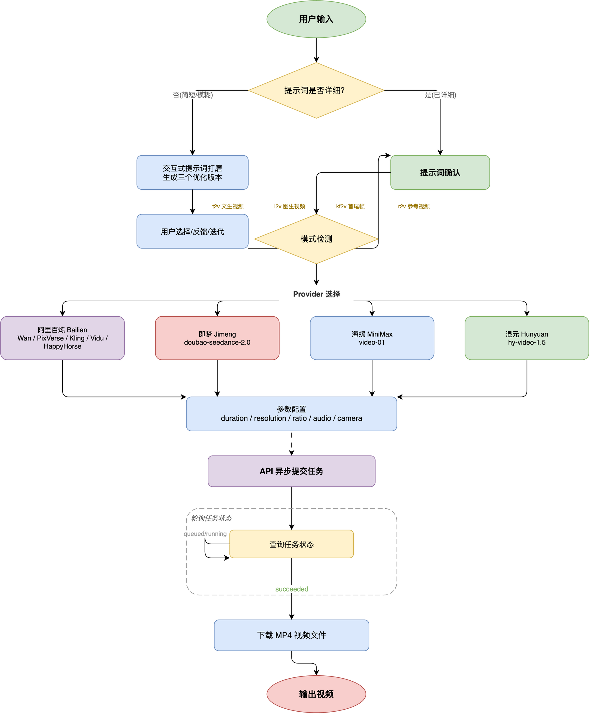

# videogenCN 🎬

[English](README.md)

一个 Claude Code / OpenClaw 技能，通过四大平台调用国产视频大模型生成视频片段 —— 阿里云百炼（万相/PixVerse/可灵/Vidu/HappyHorse）、火山引擎（即梦）、MiniMax（海螺 AI）、腾讯混元。

## 特性

- **一个脚本四种模式**:提示词 → 文生视频;`--image` → 图生视频;再加 `--last-frame` → 首尾帧;`--ref 名字=图片` → 参考生视频
- **七大模型家族、四大平台**:百炼(万相、PixVerse、可灵、Vidu、HappyHorse)、火山引擎(即梦)、MiniMax(海螺)、腾讯混元
- **平台自动检测**:`--provider` 参数手动指定，或从模型名自动检测；完全向后兼容
- **本地图片直接用**:万相/HappyHorse/即梦走 base64;PixVerse/可灵/Vidu 自动上传 OSS;MiniMax 通过文件 API 上传
- **多镜头叙事**:`wan2.7-t2v` 支持最长 15 秒、按镜头分段描述
- **音频控制**:第三方模型用 `--audio` 开启，万相用 `--no-audio` 关闭
- **可续接**:长任务会打印 task id，用 `--task-id` 恢复轮询

## 流程图



## 安装

**在 coding agent 中** — 输入：

> help me to install https://github.com/Agents365-ai/videogenCN.git

**365-Skills 市场**（在 Claude Code 中）：

```bash
/plugin install videogenCN@365-skills
```

**手动安装：**

```bash
git clone https://github.com/Agents365-ai/videogenCN.git /tmp/videogenCN
ln -s /tmp/videogenCN/skills/videogenCN ~/.claude/skills/videogenCN  # 全局
# 或：ln -s /tmp/videogenCN/skills/videogenCN .claude/skills         # 项目级
# 或：ln -s /tmp/videogenCN/skills/videogenCN ~/.openclaw/skills     # OpenClaw
```

## 系统要求

- Python 3.8+
- `pip install requests`
- 至少一个平台的 API Key（见下方）

### 平台 API Key

| 平台 | 环境变量 | 获取地址 |
|------|----------|----------|
| **百炼** (万相/PixVerse/可灵/Vidu/HappyHorse) | `DASHSCOPE_API_KEY` | https://bailian.console.aliyun.com/ |
| **即梦** (火山引擎) | `ARK_API_KEY` | https://console.volcengine.com/ark/ |
| **MiniMax** (海螺 AI) | `MINIMAX_API_KEY` | https://platform.minimax.io |
| **混元** (腾讯) | `HUNYUAN_API_KEY` | https://console.cloud.tencent.com/hunyuan |

```bash
# 百炼（默认平台，必填）
export DASHSCOPE_API_KEY='your-api-key'

# 即梦（可选）
export ARK_API_KEY='your-api-key'

# MiniMax（可选）
export MINIMAX_API_KEY='your-api-key'

# 混元（可选）
export HUNYUAN_API_KEY='your-api-key'
```

可选环境变量:

| 变量 | 用途 |
|------|------|
| `DASHSCOPE_API_BASE` | 百炼地域: `cn`(默认)/ `sg` / `us` 或完整 URL |
| `DASHSCOPE_VIDEO_MODEL` | 百炼默认模型覆盖 |

## 快速开始

**自然语言**(在 Claude Code 中):

> 用万相生成一段 5 秒的视频:一只柴犬在樱花树下奔跑
> 用即梦生成一段竖屏视频:赛博朋克雨夜街头

**命令行:**

```bash
# 文生视频（默认百炼）
python scripts/generate_video.py "一只柴犬在樱花树下奔跑,花瓣随风飘落" out.mp4

# 图生视频(让静态图动起来)
python scripts/generate_video.py "镜头缓缓推近" out.mp4 --image photo.png

# 竖屏短视频素材
python scripts/generate_video.py "赛博朋克雨夜街头" city.mp4 --ratio 9:16

# 即梦文生视频
python scripts/generate_video.py "城市日落延时摄影" sunset.mp4 --provider jimeng --duration 10

# MiniMax 图生视频
python scripts/generate_video.py "镜头缓缓推近" out.mp4 --image photo.png --provider minimax

# 混元文生视频
python scripts/generate_video.py "金黄色的麦田在秋风中起伏" field.mp4 --provider hunyuan --duration 5
```

## 模型

### 百炼 Bailian — 5 个家族

| 家族 | 模型 | 模式 | 时长 |
|------|------|------|------|
| 通义万相 | `wan2.7-t2v-*`(文生视频默认)、`wan2.6-i2v-flash`(图生视频默认)、`wan2.5/2.2/wanx2.1` 系列 | 文生、图生 | 最长 15s |
| 爱诗 PixVerse | `pixverse/pixverse-{c1,v6,v5.6}-{t2v,it2v,kf2v,r2v}` | 全部四种 | 1–15s |
| 可灵 Kling | `kling/kling-v3-video-generation`、`kling/kling-v3-omni-video-generation` | 文生、图生、首尾帧(omni 加参考生) | 3–15s |
| Vidu | `vidu/viduq3-{pro,turbo}_{text2video,img2video,start-end2video}`、`viduq2*` | 文生、图生、首尾帧 | q3: 1–16s |
| HappyHorse | `happyhorse-{1.1,1.0}-{t2v,i2v}` | 文生、图生 | 3–15s |

### 即梦 Jimeng (火山引擎)

| 家族 | 模型 | 模式 | 时长 |
|------|------|------|------|
| 即梦 Seedance | `doubao-seedance-2-0-260128`(默认)、`doubao-seedance-2-0-fast-260128`、`doubao-seedance-1-5-pro-251215`、`doubao-seedance-1-0-pro` | 文生、图生 | 最长 15s |

> ✅ 已实测：文生视频 5s，约 4 分钟，5.6 MB MP4

### MiniMax 海螺 AI

| 家族 | 模型 | 模式 | 时长 |
|------|------|------|------|
| MiniMax | `video-01`(文生/图生视频默认) | 文生、图生 | 6s |

> ✅ 已实测：文生视频 6s，约 3 分钟，2.9 MB MP4

### 混元 Hunyuan (腾讯)

| 家族 | 模型 | 模式 | 时长 |
|------|------|------|------|
| 混元 | `hy-video-1.5`(文生/图生视频默认), `yt-video-2.0`(图生，实验性), `yt-video-fx`(图生，实验性), `yt-video-humanactor`(图生，实验性) | 文生、图生 | 5–10s |

> ⚠️ **注意**：`--duration` 和 `--seed` 仅对 `hy-video-1.5` 生效。`--resolution`、`--ratio`、`--audio` 和 `--camera-motion` 暂不支持混元。实验性模型（yt-video-*）仅支持图生视频，参数为基础 prompt+image。

运行 `python scripts/generate_video.py --list-models` 查看当前列表。百炼第三方模型仅限北京(`cn`)地域。

> **费用提示**:视频生成按输出秒数计费(视模型和分辨率约 $0.04–0.14/秒)。结果 URL 24 小时后过期 —— 脚本会立即下载。

## 支持

如果这个项目对你有帮助，欢迎支持作者：

<table>
  <tr>
    <td align="center">
      
      <br>
      <b>微信赞赏</b>
    </td>
    <td align="center">
      
      <br>
      <b>支付宝</b>
    </td>
    <td align="center">
      
      <br>
      <b>Buy Me a Coffee</b>
    </td>
    <td align="center">
      
      <br>
      <b>打赏</b>
    </td>
  </tr>
</table>

## 作者

**Agents365-ai**

- Bilibili: https://space.bilibili.com/441831884
- GitHub: https://github.com/Agents365-ai

## 许可证

本项目采用 **CC BY-NC 4.0** 许可协议 — 允许非商业用途免费使用。
商业用途需获得作者授权。详见 [LICENSE](LICENSE) 文件。
